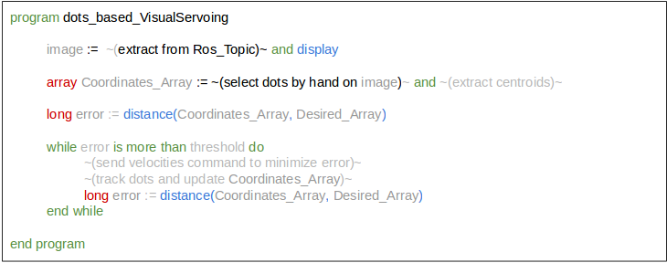
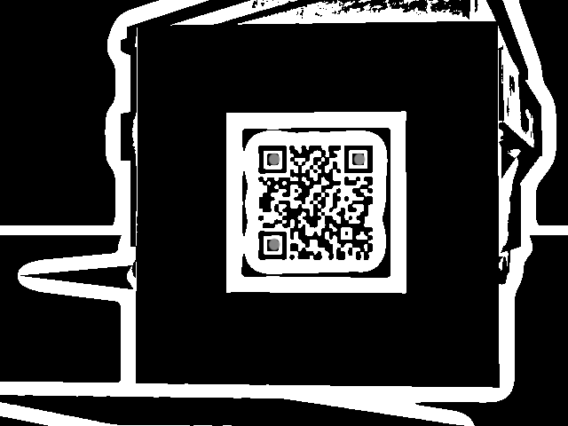

# ROS - Visual Servoing

**Table-of-contents**

* [Dependencies](#dependencies)
* [Process](#process)
* [Execution](#execution)

More description is given in the subsections.

## Dependencies

The following project has been tested with **Ubuntu 14.04 LTS**.

Since this project concern ROS Indigo libraries are needed:

* ROS Indigo - `sudo apt-get install ros-indigo-desktop-full`
* Gazebo Simulation - `sudo apt-get install ros-indigo-gazebo-ros-pkgs ros-indigo-gazebo-ros-control`

The development part has been performed using python and multiple libraries:

* Python - `sudo apt-get install pythonX.X`
* Numpy - `sudo apt-get install python-numpy`
* Matplotlib - `sudo apt-get install python-matplotlib`
* Scikit-learn - `sudo apt-get install python-sklearn`

The debugging part is using opencv

* Compiler - `sudo apt-get install build-essential`
* Required - `sudo apt-get install cmake git libgtk2.0-dev pkg-config libavcodec-dev libavformat-dev libswscale-dev`
* Optional - `sudo apt-get install python-dev python-numpy libtbb2 libtbb-dev libjpeg-dev libpng-dev libtiff-dev libjasper-dev libdc1394-22-dev`

## Process

The following code perform multiple operation to compute **visual servoing task** using **ROS Indigo** and a **Turlebot**.

* Extraction of image from the Kinect ( and dependant topic) and conversion into usable array (np.array([])).
* Computation of features on the template image (bwimage.png) using pixel counting theory.
* Extraction of key points according the the extracted features - **Clustering** .
* Computation of features on the current image extracted from the Kinect Camera of the **Turtlebot** and cluster the result to extract key points.
* Key points matching and calculation of the distance between template and the current image.
* Send velocity commands to the **Turtlebot** in order to perform IBVS ( Image Based Visual Servoing ).

##Pseudocode

## Execution

### Standard commands

Running the minimal launch and the 3Dsensor launch from ros.

* minimal - `roslaunch turtlebot-bringup minimal.launch`
* 3dsensor - `roslaunch turtlebot-bringup 3dsensor.launch`

### IBVS Task

* IBVS - ''

## Theory

### QrCode Feature Extraction

By following the pseudocode, we are able to extract an image and also a set of coordinates that corresponds to the corners.
The theory to detect corner is the ratio counting (see **Raw_Image - Qr Detection Theory**)

### Raw Image - Qr Detection Theory

No matter the line we draw on the corner of a Qr Tag, the ratio remains **[1 1 3 1 1]**
