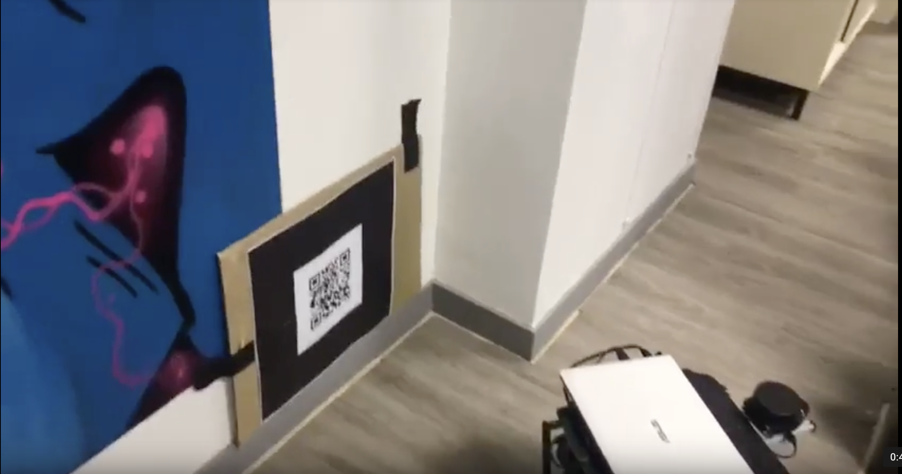

# ROS - Visual Servoing PBVS

#### This implementation rely and is based on **demo-pionneer** from [this repository](https://github.com/lagadic/demo_pioneer). The Pose Based process rely on an adaptation of the code to fit turtlebot characteristics.

**Table-of-contents**

* [Dependencies](#dependencies)
* [Process](#process)
* [Execution](#execution)

More description is given in the subsections.

## Dependencies

The following project has been tested with **Ubuntu 14.04 LTS**.

Since this project concern ROS Indigo libraries are needed:

* ROS Indigo - `sudo apt-get install ros-indigo-desktop-full`
* Gazebo Simulation - `sudo apt-get install ros-indigo-gazebo-ros-pkgs ros-indigo-gazebo-ros-control`

The development part has been performed using CPP and ViSP:

* ROS Indigo ViSP - `sudo apt-get install ros-indigo-visp-*`
* ViSP - `sudo apt-get install libvisp-dev libvisp-doc visp-images-data`

## Process

The following code perform multiple operation to compute **visual servoing task** using **ROS Indigo** and a **Turlebot**.

* Extraction of image from the Kinect ( and dependant topic) .
* Detection of the target using a predefined template.
* Estimate the position of the target in the world coordinate frame -  **PBVS** .
* Compute velocities according to the error differentiating the actual coordinates of **Turtlebot** and desired coordinates.
* Stop the velocity publishing and computation when reaching a distance contained in a threshold scale.

## Pseudocode

## Execution

### Standard commands

Running the minimal launch and the 3Dsensor launch from ros.

* minimal - `roslaunch turtlebot-bringup minimal.launch`
* 3dsensor - `roslaunch turtlebot-bringup 3dsensor.launch`

### PBVS Task

* PBVS - `roslaunch #NameOfPackage# qr_pbvs.launch`

* PBVS Simulation - `roslaunch #NameOfPackage# gazebo_qr.launch`

## Provided in the repository

### gazeboResources

This folder contains all the files concerning the template to track.

### launch

This folder contains all the launch files to run the code in real world or Gazebo.

### scripts

This folder contains all the cpp files to run the code in real world or Gazebo.

### world

This folder contains the Gazebo world to launch the code under simulation.

## Materials

### Video of the code live on robot

### Video of simulation

